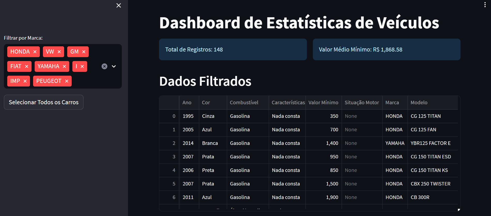
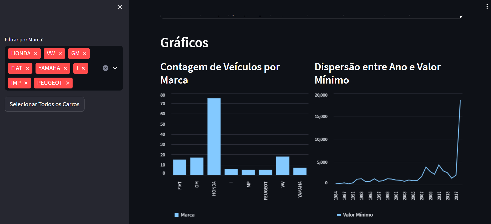

# Vehicle Statistics Dashboard

### A little bit of context:

Lately, and those who are close friends of mine know this, I've been looking to buy a car, which would be my first "big purchase". The issue is that a basic brand-new car in Brazil costs around 53 minimum wages, which adds up to nearly 4 and a half years of work for an average worker. I don't fit into that reality, but I try to stay grounded. 

A while ago, I discovered a federal government auction that includes cars seized by the government for various reasons. However, there's a problem – all this data is very messy, abundant, and without any filters on the government auction websites. 

That's why, using only Python and Streamlit as tools, I put together this Dashboard in around 25 minutes. Here, I can filter by the manufacturer's brand and minimum year of manufacture. Programming was done to solve problems intuitively. Instead of reading a static table of nearly 500 rows, it took just 30 in VSCode to solve the real problem. 
Next week, I'm going to check out the car I've chosen, in the best Data Driven way.

This Python script creates a Streamlit dashboard to display statistics and visualizations for vehicles obtained from a government auction website. The script fetches data from a specified URL, processes it, and provides interactive filtering and visualization capabilities.

### Features:

- Fetches data from a URL and processes it into a pandas DataFrame.
- Filters out rows where the "Combustível" column contains the term "Gasolina".
- Provides interactive filtering by vehicle brand (Marca) using the Streamlit sidebar.
- Displays statistics about the filtered data, such as total records and average minimum value.
- Displays the filtered data in a DataFrame table.
- Presents charts showing the vehicle count by brand and a line chart of the average minimum value per year.

### Installation:

1. Clone or download this repository to your local machine.

2. Install the required Python packages using the following command:
   pip install pandas streamlit

3. Run the Streamlit app by executing the following command:
   streamlit run dashboard.py

4. The Streamlit app will open in your default web browser, allowing you to interact with the dashboard.

### Usage:

- The sidebar allows you to select one or multiple vehicle brands to filter the data.
- Click the "Selecionar Todos os Carros" button to select all available vehicle brands.
- The dashboard displays statistics cards and interactive visualizations based on the applied filters.

### Contributing:

Contributions are welcome! If you find any issues or want to enhance the dashboard, feel free to create a pull request.

### Credits:

This dashboard script was created by Rodrigo Vanzelotti.

### License:

This project is licensed under the MIT License - see the LICENSE file for details.
